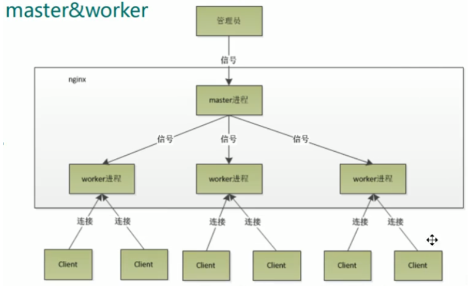
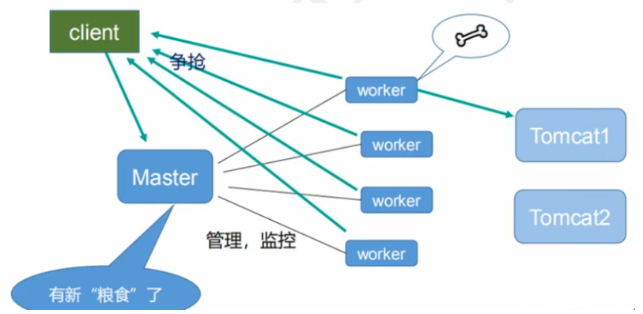

### 1.Nginx 安装

#### 系统安装


```
sudo apt-get install nginx
```

缺点：
- 不能自主选择安装版本
- 不能自主选择编译的模块
- 扩展功能变得很麻烦，需要重新编译
- 重启服务，修改配置都需要root权限

#### 编译安装

下载openssl主要用于ssl模块加密，支持https

```shell script
wget https://www.openssl.org/source/openssl-1.0.2s.tar.gz
```

下载pcre来实现对地址重定向，地址重写功能和localtion指令以及正则表达式的支持

```shell script
wget https://ftp.pcre.org/pub/pcre/pcre-8.43.tar.gz
```

下载zlib gzip压缩模块

```shell script
wget https://zlib.net/zlib-1.2.11.tar.gz
```

下载Nginx
```shell script
wget http://nginx.org/download/nginx-1.17.1.tar.gz
```

使用tar 解压所有的文件

```shell script
ls *.tar.gz | xargs -n1 tar xzvf 
```


**编译选项**

使用./configure设置各种Nginx参数的脚本，包括源和配置文件的路径，编译器选项，连接处理方法和模块列表。
该脚本通过创建编译代码和安装Nginx开源所需的Makefile来完成。

**编译安装**

1. 检查依赖
    ```shell script
    ./configure \
       --with-openssl=../openssl-1.0.2s \
       --with-pcre=../pcre-8.43 \
       --with-zlib=../zlib-1.2.11 \
       --prefix=/etc/nginx \
       --with-http_ssl_module \
       --with-http_v2_module 
    ```
   
2. 安装
    ```shell script
    make && make insatll
    ```

3. 软连接
    ```shell script
    ln -s /etc/nginx/sbin/nginx /usr/local/bin/nginx
    ```


### 2.测试

1. 启动 nginx
    ```shell script
    nginx
    ```

2. 查看进程
    ```shell script
    ps -ef | grep nginx
    ```

3. 端口访问
    - 查看默认端口：
        ```shell script
        vim /etc/nginx/conf/nginx.conf
        ```
   
        可以看到

        ```shell script
        server {
            listen       80;
            server_name  localhost;
        }
        
        ```
    - 在浏览器输入ip地址加端口号即可访问
   
### 3.Nginx常用命令

1. 查看nginx版本号

    `nginx -v`
    
2. 启动nginx

    `nginx`

3. 关闭nginx

    `nginx -s stop`
    
4. 重新加载nginx

    `nginx -s reload`
    
### 4.Nginx配置文件

nginx.conf 配置文件由三部分组成

1. 全局块

    全局块主要设置一些影响 nginx 服务器整体运行的配置指令
    
    ```shell script
    worker_processes  1;  # 值越大，可支持的并发处理量越多
    ```
   
2. Events 块

    Events 块主要影响 nginx 服务器与用户的网络连接
    ```shell script
   worker_connections  1024;  # 支持的最大连接数
    ```
  
3. http 块

    http 块是 nginx 服务器配置最频繁的部分，代理、缓存和日志定义等大多数功能和第三方模块都在此配置
    
    http 块分为 http 全局块和 server 块
    
    -  http 全局块
       
       包含文件引入、MIME-TYPE定义、日志自定义、连接超时时间、单链接请求数上限等
        ```shell script
               include       mime.types;
               default_type  application/octet-stream;
           
               #log_format  main  '$remote_addr - $remote_user [$time_local] "$request" '
               #                  '$status $body_bytes_sent "$http_referer" '
               #                  '"$http_user_agent" "$http_x_forwarded_for"';
           
               #access_log  logs/access.log  main;
           
               sendfile        on;
               #tcp_nopush     on;
           
               #keepalive_timeout  0;
               keepalive_timeout  65;
        ```
    - server 块
    
        与虚拟主机有密切联系。每个 http 块可以包括多个 server 块，每个 server 相当于一个虚拟主机。
        每个 server 块可分为全局 server 块以及可同时包含多个的 location 块
        
        **全局 server 块**：配置虚拟主机的监听配置和本虚拟主机名称或IP配置
        ```shell script
                listen       80;  # 监听端口
                server_name  localhost;  # 主机名称
        ```
        **location 块**：基于 nginx 服务器接收到的请求字符串，对虚拟主机名称（也可以的IP别名）之外的字符串进行匹配，
        对特定的请求进行处理。还包含地址定向、数据缓存、应答控制以及第三方模块配置等功能
        ```shell script
                location / {
                    root   html;
                    index  index.html index.htm;
                }
        
                #error_page  404              /404.html;
        
                # redirect server error pages to the static page /50x.html
                #
                error_page   500 502 503 504  /50x.html;
                location = /50x.html {
                    root   html;
                }
        ```
  
### 5.Nginx配置实例

#### 反向代理
1. 实现效果

    打开浏览器，在浏览器地址输入地址  www.jevis.com，跳转linux系统某个页面（tomcat主界面）中

2. 实例操作

    - tomcat 安装与启动
    
        1. 到Apache Tomcat®官网，选择tar.gz包下载，[点击跳转](https://tomcat.apache.org/download-80.cgi)
        2. 解压 tomcat 压缩包
            ```shell script
            tar -zxvf apache-tomcat-8.*.**.tar.gz
            ```
        3. 编写自启动服务程序
            
           ```shell script
           vim /lib/systemd/system/tomcat.service
           ```
           
           复制以下内容到tomcat.service中
           
           ```shell script
           [Unit]
           Description=Tomcat 9 servlet container
           After=network.target
           
           [Service]
           User=root
           
           Environment="JAVA_HOME=/usr/local/jdk1.8" ##修改为你自己的jdk路径
           Environment="JAVA_OPTS=-Djava.security.egd=file:///dev/urandom -Djava.awt.headless=true"
           Environment="CATALINA_BASE=/usr/local/apache-tomcat-8.5.65" ##修改为你自己的tomcat路径
           Environment="CATALINA_HOME=/usr/local/apache-tomcat-8.5.65" ##修改为你自己的tomcat路径
           Environment="CATALINA_TMPDIR=/usr/local/apache-tomcat-8.5.65/temp"
           Environment="CATALINA_OPTS=-Xms512M -Xmx1024M -server -XX:+UseParallelGC"
           
           ExecStart=/usr/local/apache-tomcat-8.5.65/bin/startup.sh  ##修改为你自己的tomcat路径
           ExecStop=/usr/local/apache-tomcat-8.5.65/bin/shutdown.sh ##修改为你自己的tomcat路径
           KillMode=process
           [Install]
           WantedBy=multi-user.target
           ```
           
        4. 执行自启动命令
            
            ```shell script
            systemctl daemon-reload  # 通知systemd我们创建了一个新的单位文件
            systemctl start tomcat  # 启动tomcat服务
            systemctl status tomcat  # 查看tomcat服务状态
            ```
     
    - 修改 hosts 文件
        
        进入 C:\Windows\System32\drivers\etc 文件夹，在 hosts 文件下添加
        ```shell script
        106.52.128.*** www.jevis.com
        ```
      
    - 修改 nginx.conf 文件
    
        ```shell script
        server_name  106.52.128.***;

        location / {
            root   html;
            proxy_pass  http://127.0.0.1:8080;
            index  index.html index.htm;
        }
        ```
      
    - 在本地浏览器输入 www.jevis.com 即可
    
    
### 6.Nginx原理

#### master 和 worker



#### worker如何工作？



#### 一个master多个worker的好处

首先，对于每个worker进程来说，独立的进程，不需要加锁，所以省掉了锁带来的开销，
同时在编程以及问题查找时，也会方便很多。

其次，采用独立的进程，可以让互相之间不会
影响，一个进程退出后，其它进程还在工作，服务不会中断，master进程则很快启动新的
worker进程。当然，worker进程的异常退出，肯定是程序有bug了，异常退出，会导致当
前worker.上的所有请求失败，不过不会影响到所有请求，所以降低了风险。
